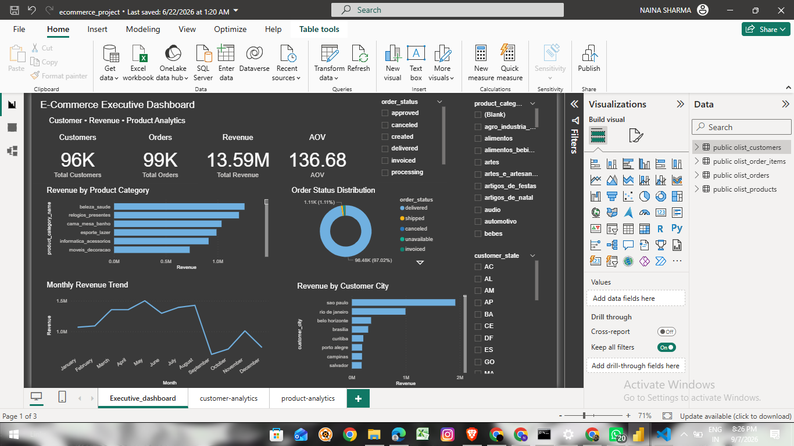
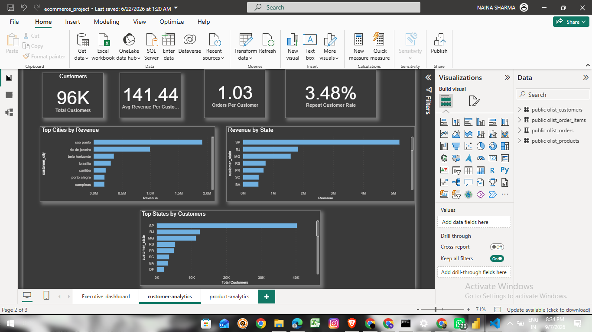
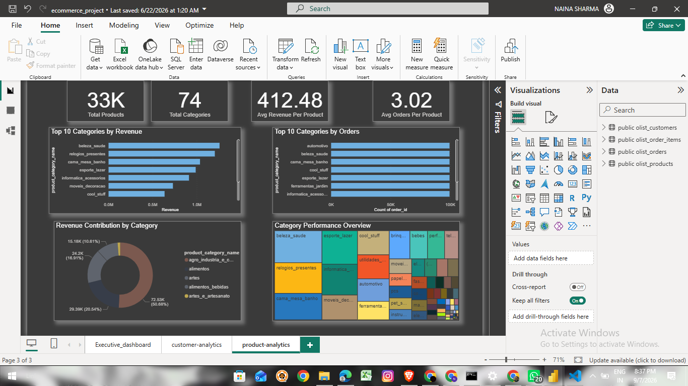

# E-Commerce Sales Analytics Dashboard

An end-to-end E-Commerce Sales Analytics project built using PostgreSQL, SQL, Power BI, and DAX.

The project analyses customer behaviour, revenue trends, product performance, order metrics, and geographic sales performance through an interactive 3-page Power BI dashboard.

---

## 📊 Dashboard Preview

### 1. Executive Overview

Key metrics and business performance overview, including revenue, orders, customers, AOV, product categories, order status, monthly revenue trends, and customer cities.

---

### 2. Customer Analytics

Customer-focused analysis covering customer revenue, orders per customer, repeat customer rate, top cities, and state-level performance.

---

### 3. Product Analytics

Product performance analysis including top categories by revenue and orders, revenue contribution, product KPIs, and category performance.

---

## Tools & Technologies

- PostgreSQL
- SQL
- Power BI
- DAX
- Microsoft Excel

---

## SQL Analysis

PostgreSQL was used for:

- Data validation
- Relationship verification
- Revenue analysis
- Customer analysis
- Product performance analysis
- Monthly revenue trends
- AOV calculation
- Repeat customer analysis
- Order status analysis
- Top 10 revenue-generating products and categories

---

## Power BI Dashboard

The dashboard includes:

- KPI Cards
- Interactive Bar Charts
- Donut Chart
- Line Chart
- Treemap
- Top N Analysis
- Interactive Slicers
- DAX Measures
- Customer Analytics
- Product Analytics
- Geographic Sales Analysis

---

## Key Business Insights

- Identified top-performing product categories based on revenue.
- Analyzed customer concentration across cities and states.
- Evaluated order status distribution.
- Identified high-value customers and products.
- Analyzed monthly revenue performance.
- Compared customer and product-level performance.

---

## Project Files

| File | Description |
|---|---|
| `ecommerce_analysis.sql` | PostgreSQL analysis queries |
| `executive-overview.png` | Executive dashboard screenshot |
| `customer-analytics.png` | Customer analytics dashboard |
| `product-analytics.png` | Product analytics dashboard |

---
